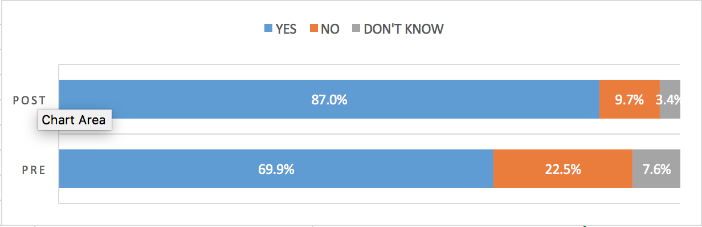
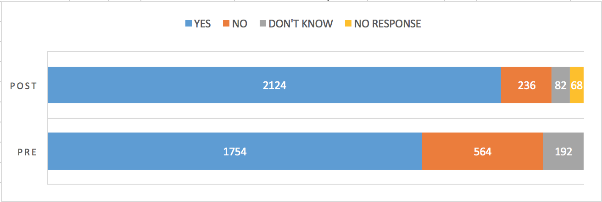

# data-viz-uncert

final project for data visualization, uncertainty and measurement error.
---

## Type of uncertainty: Non response error

## Dataset
14 districts in the state of Bihar were chosen to run a financial literacy training program. To measure the impact of the training program in each district, a survey was conducted, one before the program and one after the program. Respondents were asked five questions each. "Yes", "No" and "Don't Know" were the possible answers to each question.

For instance:

Question: Does the bank provide you with the privilege to withdraw money from your account any time you want?

Possible Answers: Yes / No / Don't know

There are 2 datasets involved - one with the survey responses before the training program was conducted and one with responses after the training program.
However, in each district, not all respondents who participated in the pre-survey were present in the post-survey, leading to a non-response bias in the post-survey analysis.

## Identifying the uncertainty

Let us take an example from the data and idetify the uncertainty in it. 

District: Allahabad

Question 1
Possible Answers: Yes / No / Don't know

Current Method            |  Including non-response
:-------------------------:|:-------------------------:
  |  